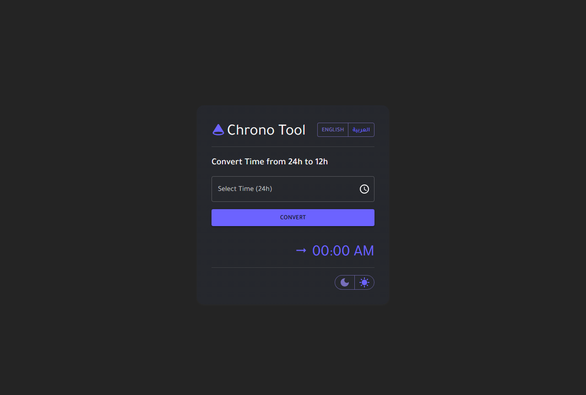
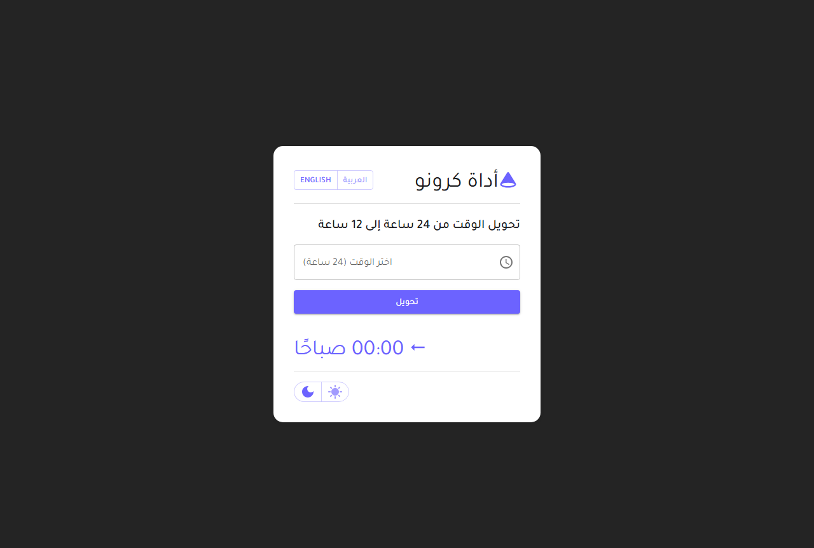

# ⌛ ChronoTool - Smart Time Converter

**ChronoTool** is a modern, lightweight, and bilingual (English/Arabic) application designed to seamlessly **convert time from 24-hour format to 12-hour format**.

Built with **React, Vite, and Material UI**, the app provides an elegant and responsive interface, offering:

* 🌙 **Dark/Light theme switching**
* 🌍 **Full multilingual support with RTL/LTR layouts**
* 📱 **Responsive design for all screen sizes**

This project showcases the practical implementation of **custom React hooks, MUI theming, internationalization, and interactive time pickers** — making it both a learning resource and a handy real-world tool.

---

## 📸 Screenshots

### 🌑 Dark Mode (English)

### ☀️ Light Mode (Arabic RTL)

---

## ✅ Features

* ⏰ Convert **24-hour → 12-hour** time format
* 🌍 **Bilingual UI (English & Arabic)** with `i18next`
* ↔️ **RTL/LTR support** based on selected language
* 🎨 **Custom MUI Theme** with dark/light mode toggle
* 📱 Fully responsive design using Material UI
* 💾 Language and theme preferences saved in **localStorage**
* 🕒 Real-time updates using MUI `TimePicker`

---

## 🧠 React Concepts & Custom Hooks

| Concept / Hook   | Usage                                                     |
| ---------------- | --------------------------------------------------------- |
| `useState`       | Manage time, locale, and theme states                     |
| `useEffect`      | Sync preferences & rerun conversions on dependency change |
| `useMemo`        | Memoize MUI theme for performance                         |
| `useTranslation` | Internationalization (i18next)                            |
| `useTheme`       | Access and apply MUI theme values                         |
| `useThemeLogic`  | Custom hook: manage theme mode + persistence              |
| `useLocaleLogic` | Custom hook: manage language switching + direction        |
| `useTimeLogic`   | Custom hook: handle time picking & 24h→12h conversion     |

---

## 🧰 Tools & Libraries

| Tool                   | Purpose                                  |
| ---------------------- | ---------------------------------------- |
| **React**              | Main UI library                          |
| **Vite**               | Fast build tool and dev server           |
| **Material UI (MUI)**  | UI components and theming                |
| **MUI X Date Pickers** | Time selection via `TimePicker`          |
| **Day.js**             | Date/time handling for `TimePicker`      |
| **i18next**            | Multilingual support (English/Arabic)    |
| **localStorage**       | Save user preferences (theme & language) |

---

## 📝 Notes

* ✅ Preferences (language/theme) persist across sessions
* 🌐 RTL direction is auto-applied for Arabic
* 🎨 Custom typography with **Tajawal font** for Arabic-friendly design

---

## 🚀 Future Ideas & Improvements

Here are some potential features that could be added in the future to enhance **ChronoTool**:

* 📅 **Date Conversion** → Add support for converting full dates between formats.
* 🌐 **More Languages** → Extend i18n to include additional languages (e.g., French, Spanish).
* 🔔 **Reminders/Notifications** → Allow users to set alerts for specific times.
* 📊 **History Tracking** → Save and display previously converted times.
* 🎨 **Custom Themes** → Let users pick their own color palettes in addition to light/dark mode.
* 📱 **Mobile App Version** → Convert this project into a PWA for offline/mobile use.

---

## 🔗 Live Demo

Check out the live version of **ChronoTool** here:
- 🌐 [Live ChronoTool](https://maher-elmair.github.io/ChronoTool/)

---

## 🧑‍💻 Author

**Maher Elmair**

* 📫 [maher.elmair.dev@gmail.com](mailto:maher.elmair.dev@gmail.com)
* 🔗 [LinkedIn](https://www.linkedin.com/in/maher-elmair)
* ✖️ [X (Twitter)](https://x.com/Maher_Elmair)
* ❤️ Made with passion by [Maher Elmair](https://maher-elmair.github.io/My_Website)

---

## 💡 Contribution

If you have an idea from the list above (or your own suggestion ✨), feel free to share it with me — I’m always open to improvements and would be glad to collaborate!

---

## ⭐ Support

Thanks for reading this far 🙏.
I’d be really happy if you liked the project or gave it a **star** ⭐ on GitHub.

---
